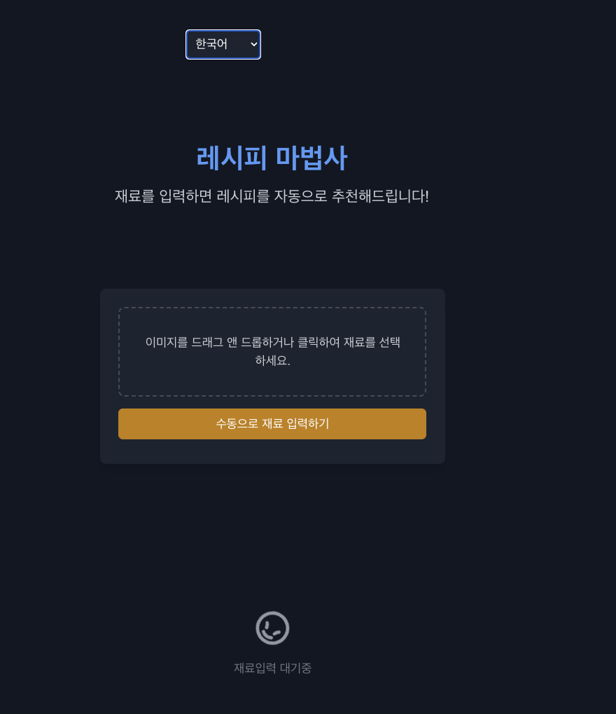
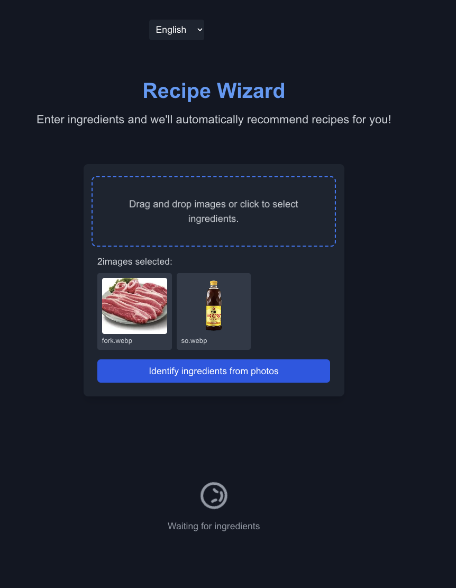
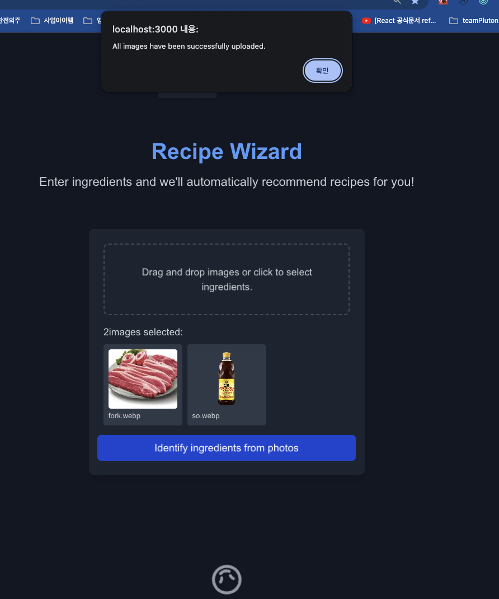
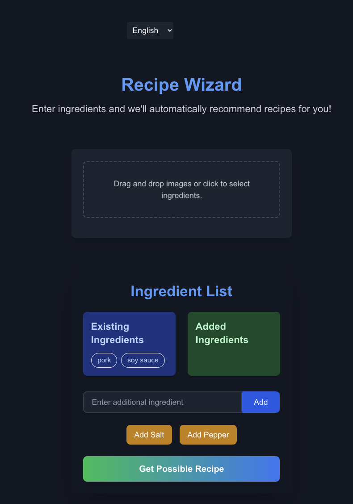
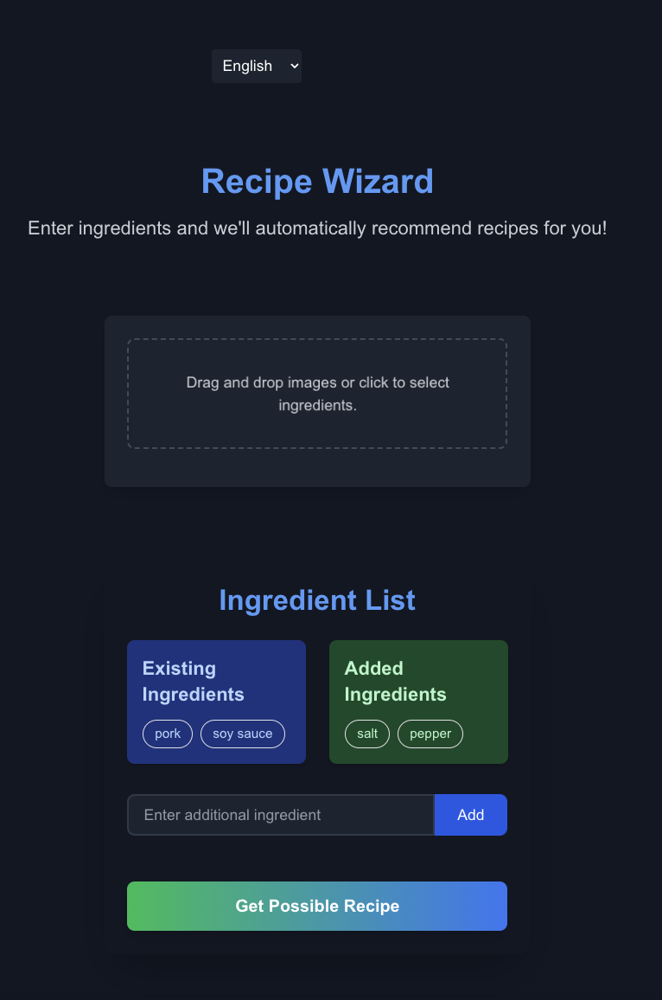
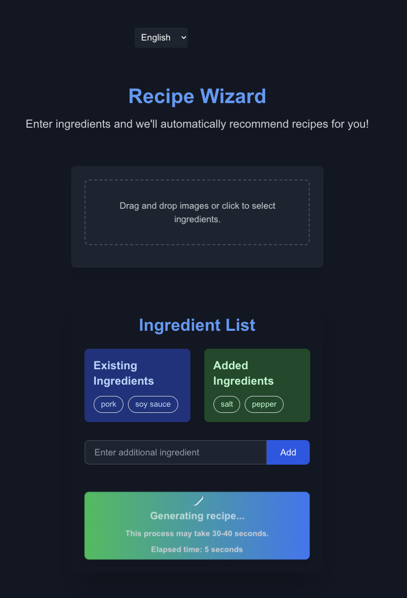
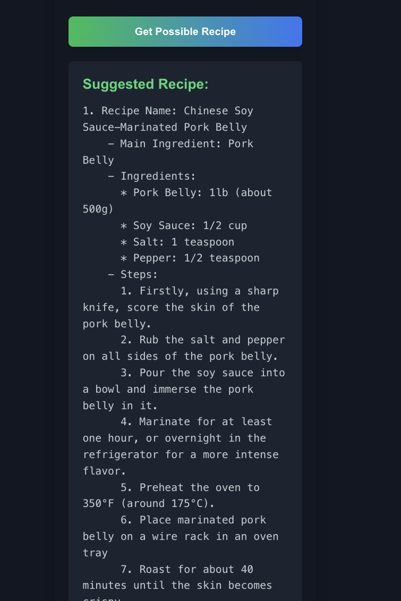

# Ingrecipi

Ingrecipi is a user-friendly recipe website designed to help users discover delicious recipes based on the ingredients they have on hand. Whether you’re a seasoned chef or a home cook, Ingrecipi will provide you with creative meal ideas by simply entering the ingredients you already have in your pantry or fridge.

# 언어지원

English,Korean,Russian,Japanese

# deloiy: https://ingrecipe.ludgi.ai

# sitemap: https://ingrecipe.ludgi.ai/sitemap.xml

# preview

# reference

- https://platform.openai.com/docs/guides/vision
